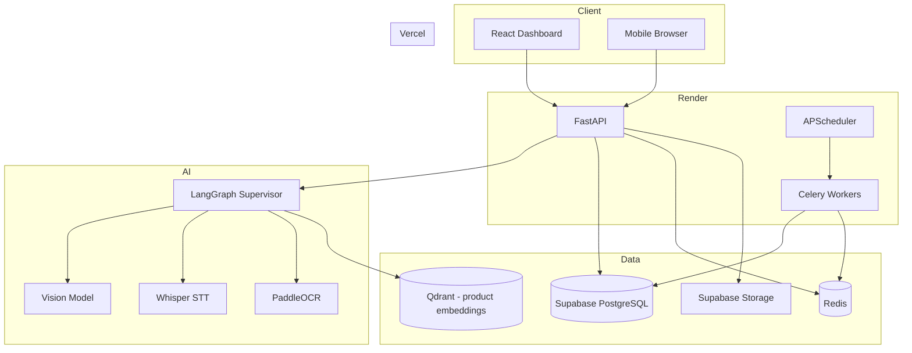
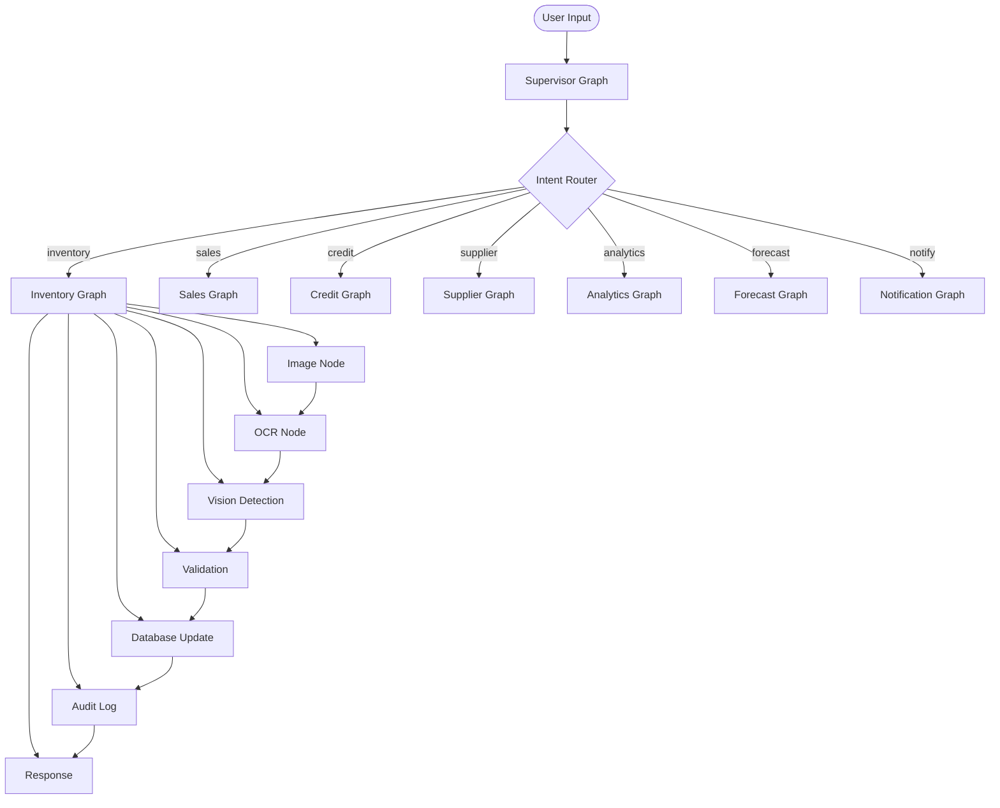
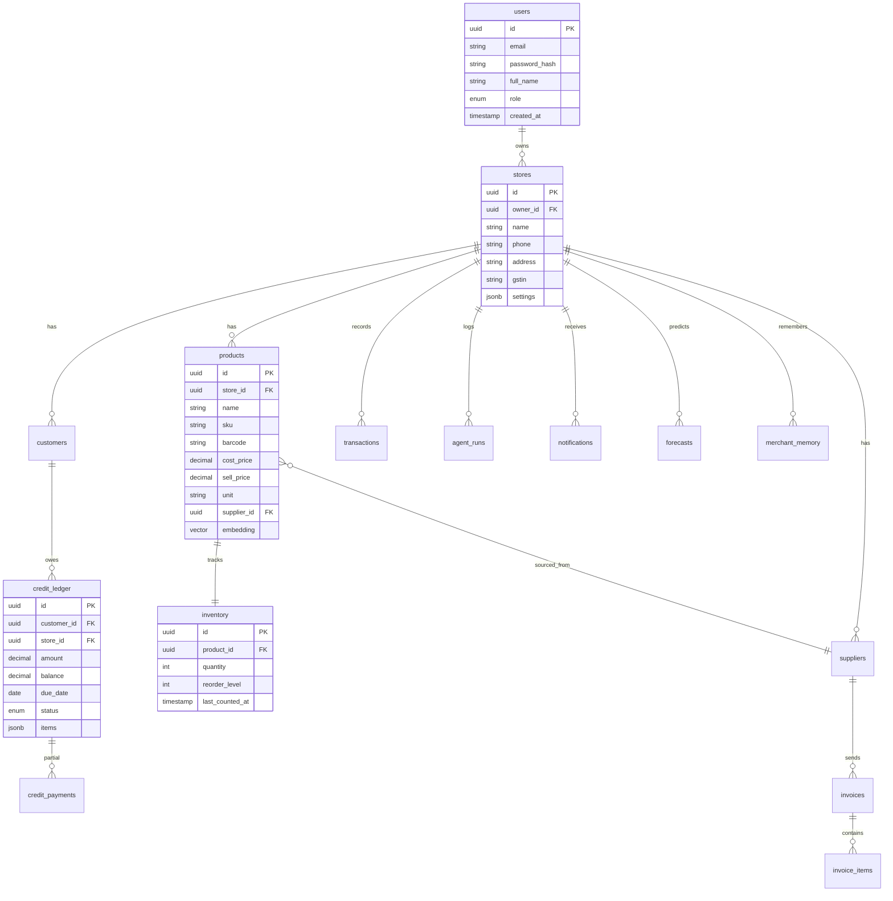

# RetailOS — Software Design Document

> AI Operating System for Small Retail Businesses

---

## 1. Product Vision

RetailOS eliminates manual inventory work for local merchants (kirana, grocery, hardware, medical, cosmetic, electronics, stationery). The product is **not a chatbot** — it is an operating system that:

- Updates inventory from photos, voice, and invoices
- Tracks customer credit automatically
- Surfaces profit/loss and demand insights
- Reminds merchants about repayments and reorder dates

**Target user:** Shop owner with 50–500 SKUs, smartphone-first, low tolerance for complex software.

**Success metric:** Time spent on inventory drops from ~2 hrs/day to &lt;15 min/day.

---

## 2. User Flows

### Onboarding
```
Sign up → Create store → Add first products (voice/photo/manual) → Dashboard
```

### Photo Inventory
```
Open AI Inventory → Take shelf photo → AI detects products + quantities
→ Merchant confirms/corrects → Stock updated → Audit log
```

### Voice Inventory
```
Tap mic → "Sold 2 Boat earphones" → Intent extracted → Stock decremented
```

### Invoice Upload
```
Upload PDF/image → OCR + LLM parse → Review line items → Stock + supplier updated
```

### Customer Credit
```
"Rahul took charger ₹500, pays Monday" → Ledger entry → Reminder scheduled
```

---

## 3. System Architecture



---

## 4. LangGraph Architecture



### Supervisor Graph Nodes

| Node | Role |
|------|------|
| `input_normalizer` | Normalize text/audio/image input |
| `intent_classifier` | Route to subgraph (inventory, credit, analytics…) |
| `context_loader` | Load merchant memory (frequent products, suppliers) |
| `subgraph_dispatcher` | Invoke target graph with checkpoint |
| `response_formatter` | Stream structured response to client |
| `eval_hook` | Log confidence scores for evaluation |

### Inventory Graph Nodes

| Node | Role |
|------|------|
| `image_preprocess` | Resize, enhance, segment shelf regions |
| `ocr_extract` | PaddleOCR on labels |
| `vision_detect` | Detect products + estimate quantities |
| `product_matcher` | Match to catalog via embeddings + fuzzy name |
| `duplicate_detector` | Flag likely duplicate SKUs |
| `quantity_validator` | Cross-check OCR vs vision counts |
| `human_confirm_gate` | Pause for merchant confirmation if confidence &lt; threshold |
| `inventory_mutator` | Apply stock delta (add/remove/adjust) |
| `audit_writer` | Write agent_run + inventory_transaction |
| `response_builder` | Return diff + suggestions |

### Credit Graph Nodes

| Node | Role |
|------|------|
| `credit_parser` | Extract customer, amount, due date, items |
| `customer_resolver` | Match/create customer record |
| `ledger_writer` | Create credit_ledger entry |
| `reminder_scheduler` | Schedule notification via Celery |
| `partial_payment_handler` | Apply partial payments to balance |

### Analytics Graph Nodes

| Node | Role |
|------|------|
| `sql_planner` | Generate safe read-only SQL from natural language |
| `sql_executor` | Run against store-scoped views |
| `insight_generator` | LLM summarizes query results into actionable insights |
| `chart_spec_builder` | Return Recharts-compatible data spec |

---

## 5. Database Schema



### Key Tables

| Table | Purpose |
|-------|---------|
| `users` | Auth + RBAC (owner, staff) |
| `stores` | Multi-tenant boundary |
| `products` | SKU catalog with embeddings for matching |
| `inventory` | Current stock levels |
| `inventory_transactions` | Every stock change (audit trail) |
| `customers` | Buyer profiles |
| `credit_ledger` | Udhar / credit entries |
| `credit_payments` | Partial payment history |
| `suppliers` | Vendor directory |
| `invoices` | Purchase invoices |
| `invoice_items` | Line items from parsed invoices |
| `transactions` | Sales/purchase events |
| `forecasts` | Demand predictions per product |
| `notifications` | Reminders (credit, reorder) |
| `agent_runs` | LangGraph execution logs |
| `merchant_memory` | Long-term AI memory (not chat history) |
| `audit_logs` | Security + compliance trail |

---

## 6. API Design

Base URL: `/api/v1`

### Auth
| Method | Path | Description |
|--------|------|-------------|
| POST | `/auth/register` | Create account |
| POST | `/auth/login` | JWT login |
| POST | `/auth/refresh` | Refresh token |
| GET | `/auth/me` | Current user |

### Inventory
| Method | Path | Description |
|--------|------|-------------|
| GET | `/inventory` | List stock (paginated) |
| POST | `/inventory` | Manual stock entry |
| PATCH | `/inventory/{id}` | Adjust quantity |
| POST | `/inventory/photo` | Upload shelf photo → AI pipeline |
| POST | `/inventory/voice` | Upload audio → voice pipeline |
| GET | `/inventory/transactions` | Audit trail |

### Products
| Method | Path | Description |
|--------|------|-------------|
| GET | `/products` | List products |
| POST | `/products` | Create product |
| PATCH | `/products/{id}` | Update product |
| DELETE | `/products/{id}` | Soft delete |

### Invoices
| Method | Path | Description |
|--------|------|-------------|
| POST | `/invoices/upload` | Upload PDF/image |
| GET | `/invoices` | List invoices |
| GET | `/invoices/{id}` | Invoice detail |
| POST | `/invoices/{id}/confirm` | Confirm parsed data → update stock |

### Credit
| Method | Path | Description |
|--------|------|-------------|
| GET | `/credit` | Credit ledger list |
| POST | `/credit` | Create credit entry (manual or via AI) |
| POST | `/credit/{id}/payment` | Record partial payment |
| GET | `/credit/overdue` | Overdue credits |

### Analytics
| Method | Path | Description |
|--------|------|-------------|
| GET | `/analytics/dashboard` | KPIs (revenue, profit, top sellers) |
| GET | `/analytics/insights` | AI-generated insights |
| POST | `/analytics/query` | Natural language smart search |

### Forecast
| Method | Path | Description |
|--------|------|-------------|
| GET | `/forecast` | Demand forecasts |
| POST | `/forecast/generate` | Trigger forecast job |

### AI Agent
| Method | Path | Description |
|--------|------|-------------|
| POST | `/agent/run` | Unified AI entry (routes via supervisor) |
| GET | `/agent/runs` | Execution logs |
| GET | `/agent/runs/{id}` | Run detail + node trace |
| GET | `/agent/runs/{id}/stream` | SSE stream |

### Customers & Suppliers
| Method | Path | Description |
|--------|------|-------------|
| CRUD | `/customers` | Customer management |
| CRUD | `/suppliers` | Supplier management |

---

## 7. Folder Structure

```
retailos/
├── docs/
│   └── DESIGN.md
├── backend/
│   ├── alembic/
│   ├── app/
│   │   ├── main.py
│   │   ├── api/v1/
│   │   │   ├── router.py
│   │   │   ├── auth.py
│   │   │   ├── inventory.py
│   │   │   ├── products.py
│   │   │   ├── invoices.py
│   │   │   ├── credit.py
│   │   │   ├── analytics.py
│   │   │   ├── forecast.py
│   │   │   ├── agent.py
│   │   │   ├── customers.py
│   │   │   └── suppliers.py
│   │   ├── core/
│   │   │   ├── config.py
│   │   │   ├── database.py
│   │   │   ├── security.py
│   │   │   └── deps.py
│   │   ├── models/
│   │   ├── schemas/
│   │   ├── services/
│   │   ├── agents/
│   │   │   ├── state.py
│   │   │   ├── supervisor.py
│   │   │   ├── graphs/
│   │   │   ├── nodes/
│   │   │   ├── tools/
│   │   │   ├── memory/
│   │   │   └── eval/
│   │   ├── workers/
│   │   └── middleware/
│   ├── requirements.txt
│   └── alembic.ini
├── frontend/
│   └── src/
│       ├── pages/
│       ├── components/
│       ├── features/
│       ├── hooks/
│       ├── lib/
│       └── types/
├── docker-compose.yml
└── README.md
```

---

## 8. Backend Architecture

```
Request → Middleware (CORS, rate limit, auth)
       → API Router (validation via Pydantic)
       → Service Layer (business logic)
       → Repository (SQLAlchemy queries)
       → Database

AI Request → API → Celery task (async) OR sync agent run
                → LangGraph Supervisor
                → Subgraph execution (checkpointed)
                → Service Layer (persist results)
                → SSE stream / webhook response
```

**Patterns:**
- Multi-tenant: every query scoped by `store_id`
- Async AI: photo/invoice processing via Celery + Redis
- Idempotency: agent runs keyed by `run_id` for retries
- Optimistic locking on inventory updates

---

## 9. Frontend Architecture

```
App
├── AuthProvider (JWT)
├── QueryClientProvider (React Query)
├── Router
│   ├── /login
│   ├── /dashboard
│   ├── /inventory
│   ├── /ai-inventory
│   ├── /customers
│   ├── /credit
│   ├── /invoices
│   ├── /suppliers
│   ├── /analytics
│   ├── /forecast
│   ├── /settings
│   ├── /agent-logs
│   └── /profile
└── Layout (sidebar + header)
```

**State:**
- Server state → React Query (inventory, analytics, credit)
- Form state → React Hook Form + Zod
- Auth → Context + localStorage refresh token
- AI streaming → EventSource (SSE)

---

## 10. AI Architecture

| Input | Pipeline | Output |
|-------|----------|--------|
| Shelf photo | Preprocess → OCR → Vision → Match → Confirm | Stock delta |
| Voice | Whisper → Intent LLM → Entity extract → Mutate | Stock/credit delta |
| Invoice | OCR/PDF parse → LLM structure → Validate | Invoice + stock |
| NL query | SQL planner → Execute → Insight LLM | Answer + chart |
| Credit phrase | NER + date parse → Ledger write | Credit entry |

**Models:**
- Intent/routing: GPT-4o-mini or Groq Llama (fast, cheap)
- Vision: GPT-4o vision or dedicated model
- Embeddings: sentence-transformers (product matching)
- Vector store: Qdrant (product dedup only)

**Memory (merchant_memory table):**
- Top 20 products by sale frequency
- Common voice corrections ("charger" → "Samsung 25W Charger")
- Customer payment behavior scores
- Preferred reorder quantities

**MCP (optional integrations):**
- WhatsApp reminders (Twilio / WhatsApp Business API)
- Google Calendar for due dates
- Google Sheets export for accountant

---

## 11. Evaluation Strategy

| Metric | Method | Threshold |
|--------|--------|-----------|
| OCR field accuracy | Compare extracted vs ground truth | ≥ 90% |
| Intent classification | Labeled voice samples | ≥ 95% |
| Entity extraction F1 | Product/qty/price from voice | ≥ 90% |
| Vision confidence | Avg detection confidence | ≥ 0.75 |
| Tool success rate | DB writes after agent run | ≥ 99% |
| Hallucination rate | Faithfulness check on insights | ≤ 5% |
| End-to-end latency | Photo → confirmed stock | &lt; 30s |

**Tools:** LangSmith traces, custom eval scripts in `agents/eval/`, DeepEval for LLM outputs.

---

## 12. Observability

- **LangSmith:** Every LangGraph node trace, token usage, cost
- **OpenTelemetry:** API latency, DB query time, Celery queue depth
- **Structured logs:** JSON logs with `store_id`, `run_id`, `node_name`
- **Metrics:** Prometheus-compatible counters (agent_runs_total, errors_total)
- **Alerts:** Agent failure rate &gt; 5%, p95 latency &gt; 10s

---

## 13. Deployment

| Component | Platform | Notes |
|-----------|----------|-------|
| Frontend | Vercel | `frontend/` root, env: `VITE_API_URL` |
| Backend API | Render Web Service | `uvicorn app.main:app` |
| Celery Worker | Render Background Worker | Same image, different start command |
| PostgreSQL | Supabase | Managed Postgres + connection pooling |
| Redis | Upstash or Render Redis | Celery broker + cache |
| Storage | Supabase Storage | Invoice images, shelf photos |
| Qdrant | Qdrant Cloud free tier | Product embeddings |

---

## 14. Scaling Strategy

**Phase 1 (0–100 stores):** Single Render instance, Supabase free tier  
**Phase 2 (100–1K stores):** Separate worker dynos, read replicas, Redis cache for analytics  
**Phase 3 (1K+ stores):** Queue prioritization, batch forecasting, CDN for images  

**Bottlenecks to watch:**
- Vision API cost → cache embeddings, batch OCR
- DB writes on inventory → connection pooling, batch transactions
- Celery queue backlog → autoscale workers

---

## 15. Security

- JWT access (15 min) + refresh (7 days)
- RBAC: `owner` (full), `staff` (inventory + sales only)
- Rate limiting: 100 req/min per store
- Input validation: Pydantic + Zod on both ends
- SQL agent: read-only views, parameterized queries only
- Audit logs on all inventory/credit mutations
- File upload: type validation, size limits, virus scan (future)

---

## 16. 6–8 Week Build Plan

| Week | Focus |
|------|-------|
| 1 | Auth, stores, products, manual inventory CRUD |
| 2 | Voice inventory pipeline (Whisper + intent) |
| 3 | Photo inventory (OCR + vision + confirm UI) |
| 4 | Invoice parser + supplier management |
| 5 | Credit ledger + reminders |
| 6 | Analytics dashboard + AI insights |
| 7 | Forecasting + smart search |
| 8 | Eval, observability, polish, deploy |

---

## 17. Future Roadmap

- WhatsApp bot for voice inventory (no app open)
- Barcode scanner integration
- Multi-store chain support
- GST filing export
- POS billing integration
- Offline-first PWA with sync
- Regional language support (Hindi, Tamil, Telugu)
- Supplier price comparison
- Loyalty program for customers
